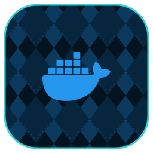

  

# docker

Adapts the Docker Engine + Compose into orca's containers domain — it drives your existing Docker install.

A first-party [orca](https://github.com/argyle-labs/orca) plugin (containers backend).

This is a **backend/adapter** — it has no service of its own; it wires an existing system into orca.

---

## Run it without orca

There's nothing to deploy: this plugin drives software you already run (upstream: <https://docs.docker.com/engine/install/>). Install/configure that directly, then register it with orca.

## With orca

orca drives this plugin through its generic surface — rich, docker-specific data comes back in the typed `service.status` payload, never bespoke tools.

## Layout

- `src/` — the plugin (pure Rust): the `ServiceBackend` descriptor + `configure` / `status`.
- `scripts/` — provisioning / lifecycle helpers.
- `assets/` — plugin icon.
