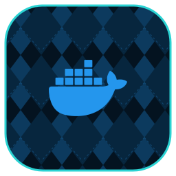

<p align="center">
  
</p>

# docker

Adapts the Docker Engine + Compose (and Colima / Podman) into [orca](https://github.com/argyle-labs/orca)'s containers domain — it provisions, upgrades, backs up, and drives a container runtime on any host.

A first-party orca plugin (containers backend). This is a **backend/adapter**: it has no service of its own, it manages the container runtime and the stacks you run on it.

## What it manages

- **Provision / upgrade** a container runtime — **Docker Engine**, **Colima**, or **Podman** — on any target (macOS, Alpine, Debian/Ubuntu, CachyOS/Arch, Fedora, and atomic/immutable hosts like Bazzite).
- **Manage Compose stacks as config** — register a stack, then **view / edit / deploy** its compose file over cli / api / mcp (orca is the config manager), plus the full `up` / `down` / `restart` / `start` / `stop` / `build` / `pull` / `logs` lifecycle.
- **Inventory** — list / inspect containers through orca's five-verb surface.
- **Back up / restore** the engine's persistent state.

Everything here works **two ways, and both are supported and documented**:

- **With orca** — orca fully manages it: call the `docker.*` tools and orca runs the right thing on the host.
- **Without orca (standalone)** — run the shipped `scripts/*.sh` directly. Install and update run the *same* scripts orca invokes; backup and restore are done in-process by orca (with entry checks the scripts cannot do), and the scripts produce and read the same archive format.

---

## With orca (orca manages everything)

Once orca is on the host you never touch the scripts — drive the tools. Payloads are typed; examples live in [`examples/`](examples/).

| tool | what it does | key args |
| --- | --- | --- |
| `docker.install` | provision + start a runtime (the embedded `scripts/install.sh`; no other script can be run). Admin, dry run included; dry run by default | `runtime`: `docker`\|`colima`\|`podman`; `execute` |
| `docker.engine_update` | upgrade the runtime (the embedded `scripts/update.sh`). Admin, dry run included; dry run by default | `runtime`; `execute` |
| `docker.update` | run a Compose lifecycle action against a stack | `path`, `action`, optional `service` |
| `docker.list` | host docker resources: engine status + registered runtimes; plus compose services (`path`) or a project scan (`root`) | optional `path` \| `root` |
| `docker.detail` | inspect one Compose project: services, logs, stats | `path`, optional `service`, `tail` |
| `docker.create` | register a docker runtime | `runtime_name`, one of `socket_path`\|`host`\|`url` |
| `docker.delete` | remove a registered docker runtime | `runtime` |
| `docker.backup` | archive engine state to a mode-0600 `.tar.gz` (written under a temporary name, then renamed). Config only: VM and disk images (`_lima/_disks/`, which is colima's data disk holding container images and volumes; `_lima/<instance>/{basedisk,diffdisk,disk}`; any `*.iso`/`*.img`/`*.qcow2`/`*.raw`), lima's VM ssh keypair (`_lima/_config/user{,.pub}`, regenerated on start), sockets and links pointing outside the state dir are left out and listed in `excluded`. `destination` must be absolute and resolve, symlinks included, inside one of the daemon's backup roots (`ORCA_DOCKER_BACKUP_ROOTS`, comma-separated, else `/mnt/backups`; set it on macOS); `state_path` inside `$HOME/.colima` (the default). Admin, dry run included; dry run by default validates the paths and returns the resolved ones | `destination`, optional `state_path`; `execute` |
| `docker.restore` | restore engine state from a `docker.backup` archive, in-process: the archive is opened once and every entry is checked from that same file before it is extracted. `archive` must be absolute and inside a backup root; `state_path` must resolve inside `$HOME/.colima` (the default). Refused: absolute or `..` entries, links whose target is absolute or contains `..`, anything but files, directories and links, and a state dir already holding a symlink that leads outside it. Ownership is never restored and modes are masked to owner-only (no setuid/setgid). Archives over 4 GiB uncompressed or 100k entries are refused. The archive is extracted into a sibling temp dir, entries the archive lacks (the VM disks) are moved across, and the dirs are swapped by rename, so a failed restore leaves the state dir as it was. Restores config only: the VM disk is recreated on the next `colima start`, and container images and volumes are not in this backup (back up volumes through the stack backup). Admin, dry run included; dry run by default validates everything and returns the resolved target | `archive`, optional `state_path`; `execute` |
| `docker.prune` | remove dangling images (untagged, including digest-only pulls), dangling anonymous volumes and compose networks no container (running or stopped) uses; never named volumes, never a network a managed stack declares `external`. `stack` scope attributes a volume by `orca.stack`, else `com.docker.compose.project`, else a container mounting it (compose labels anonymous volumes with neither, so only orca-labeled ones are found). Dry run by default | optional `stack`; `execute` + `items` from the dry run |
| `docker.label_audit` | every container, volume and network without `orca.managed`, grouped by inferred owner (`orca.stack` or the compose project label, else the container that mounts or attaches it). Read-only; admin | none |
| `docker.host_update` | upgrade the confirmed upgradable OS packages (apk/apt, engine packages flagged: they restart every container), then `compose pull -q` + `up -d` for every running stack, first removing, by id, each confirmed orphan container that is still an orphan at that moment (orphans as compose defines them: services from every profile count as declared), then prune dangling images; behind the pre-update backup gate. Stacks whose compose can't be read are reported as skipped. Dry run by default | `execute` + `items` (`package:*`, `stack:*`, `orphan:*`, `image:*`) from the dry run; `skip_backup_gate` until orca#767 |

> Individual **containers** and managed **Compose stacks** are not `docker.*` tools — they are surfaced on orca's generic five-verb **unit** surface (`docker.__unit.*`). The `docker.*` tools above manage the runtime, its registered engines, and one-off Compose projects by path. See **[Managing Compose stacks](#managing-compose-stacks-orca-as-config-manager)** below.

```jsonc
// docker.install — provision colima (default), Docker Engine, or podman.
// Without execute it returns the plan; install, engine_update, backup and restore need an admin caller, dry run included.
{ "runtime": "docker", "execute": true }

// docker.update — bring a Compose stack up
{ "path": "/srv/stacks/myapp", "action": "up" }

// docker.detail — inspect a Compose project (services + logs + stats)
{ "path": "/srv/stacks/myapp", "tail": 200 }

// docker.create — register a docker runtime (needs socketPath | host | url)
{ "runtimeName": "remote-host", "host": "tcp://10.0.0.5:2375" }

// docker.backup / docker.restore
{ "destination": "/mnt/backups/docker", "execute": true }
{ "archive": "/mnt/backups/docker/docker-engine-state-20260702-120000.tar.gz", "execute": true }

// docker.prune — dry run lists candidates; execute removes only confirmed ones still orphaned
{ "stack": "media" }
{ "execute": true, "items": ["volume:3f2a…", "network:9b1c…"] }
```

The lifecycle tools are `local_only` — they act on the host orca is running on.

### Managing Compose stacks (orca as config manager)

orca is your **config manager** for `docker compose`: register a stack once and
then **view / edit / deploy** its compose file entirely over the cli / api / mcp —
no need to SSH in and hand-edit YAML. A *stack* is a name bound to a project
directory on the host; orca owns the registry of managed stacks (persisted in its
per-plugin store) while the compose file stays canonical on disk.

Stacks ride orca's generic **unit** surface as the `stack` kind (the same surface
the [dockge](https://github.com/argyle-labs/dockge) plugin uses, so one stack
vocabulary spans both). Every operation is available through `unit` list / detail
/ update / create / upsert / delete with `kind = "stack"`:

| operation | verb | payload |
| --- | --- | --- |
| **list** stacks + service status | `list` | `query.kind = "stack"` |
| **view** compose YAML + `.env` + status | `detail` | `id.kind = "stack"`, `id.id = <name>` |
| **tail** stack logs | `detail` | `id.kind = "stack"`, `query.kind = "logs"` |
| **edit** (rewrite YAML/env, no deploy) | `update` | `action = "edit"`, `{ compose_yaml?, compose_env? }` |
| **audit** (lint: restart policy, bind sources, named volumes) | `detail` | `query.kind = "audit"`, optional `query.extra = { managed_roots }` |
| **fix** audit findings (dry run by default, shows the diff) | `update` | `action = "fix"`, `{ execute?, items?, managed_roots? }` |
| **coverage** of named volumes by the stack backup, plus anonymous and unlabeled volumes | `detail` | `query.kind = "coverage"` |
| **convert anonymous volumes** to labeled named volumes, copying and verifying the data (dry run by default) | `update` | `action = "label_volumes"`, `{ execute?, items? }` |
| **declare** how a named volume is backed up (dry run by default) | `update` | `action = "volume_policy"`, `{ volume, strategy?: export\|dump, service?, command?, execute? }` |
| **deploy / lifecycle** | `update` | `action = up`\|`down`\|`start`\|`stop`\|`restart`\|`build`\|`pull` |
| **register + deploy** (add-only) | `create` | `action = "deploy"`, deploy payload |
| **register-or-replace + deploy** | `upsert` | `action = "set"`, deploy payload |
| **deregister** (leaves containers running) | `delete` | `id.kind = "stack"`, `id.id = <name>` |

**Ownership labels.** Every `up`, deploy and restore regenerates `compose.orca.yaml` next to the compose file and passes it last (`-f`). Orca's other compose calls on the stack pass only the user's files, so a stale `compose.orca.yaml` never breaks them; coverage regenerates it before reading. The user's compose file is never edited.

The file labels each service, and each network and top-level named volume that does not exist yet, with the orca#772 contract: `orca.managed=true`, `orca.owner=docker`, `orca.stack=<project>`, `orca.service`, `orca.unit=<stack name>`, `orca.mount`.
- **Existing networks and volumes are never relabeled.** Labels on them can't change in place. Compose recreates a network whose declaration changed, which takes the stack down and fails while another project's container (say, a reverse proxy) is attached. A changed volume declaration can make compose offer to recreate the volume, which deletes its data.
- **Reporting:** `up` prints a note for each existing network it left unlabeled, naming any other project's containers attached to it. `coverage` and `docker.label_audit` report unlabeled volumes.
- **Recreation:** the first labeled `up` recreates the stack's containers once; the `label_volumes` plan warns which ones.

`label_volumes` converts each anonymous volume into the named volume `<project>_<service>_<path-slug>`, declared in `compose.orca.yaml`. A generated key that collides with another volume key of the stack, ignoring case, is refused. For each service it:
1. stops the service, if it is running (a stopped service is left stopped);
2. refuses while any running container still mounts the old volume;
3. creates the target volume with labels;
4. copies with GNU tar (`--xattrs --acls --sparse`) in a pinned Debian slim helper with no network, mounting the old volume read-only;
5. compares sha256 digests of a name-sorted POSIX tar of each volume. That covers type, mode, owner, mtime, xattrs, ACLs, link targets, device numbers and content.
6. declares the conversion, checks again for running writers, then runs `up`. For a stopped service it runs `up --no-start`.

The old volume is removed only after verification and a successful `up`, and only when no container references it.
- **A failure before `up`** restores the previous override, removes the new volume, and starts the service again if it was stopped for the copy.
- **A failed `up`** restores the previous override and recreates the service from it.

The conversions live only in `compose.orca.yaml`. A plain `docker compose down && docker compose up` outside orca, without `-f compose.orca.yaml`, ignores them and starts the service on a fresh anonymous volume.

```jsonc
// create (action=deploy) — write a brand-new stack's compose file and bring it up.
// Omit compose_yaml to register an existing on-disk compose file as-is.
{
  "action": "deploy",
  "payload": {
    "name": "myapp",
    "dir": "/srv/stacks/myapp",
    "compose_yaml": "services:\n  web:\n    image: nginx\n    ports: [\"8080:80\"]\n",
    "compose_env": "TZ=UTC\n",
    "deploy": true
  }
}

// detail (view) — returns { name, dir, file, compose_yaml, compose_env, services[] }
{ "id": { "manager": "docker@host", "kind": "stack", "id": "myapp", "name": "myapp" } }

// update (edit) — change the YAML without redeploying
{ "id": { "kind": "stack", "id": "myapp", ... }, "action": "edit",
  "payload": { "compose_yaml": "services:\n  web:\n    image: nginx:1.27\n" } }

// update (deploy the edit) — bring the changed stack up
{ "id": { "kind": "stack", "id": "myapp", ... }, "action": "up" }

// detail (audit) — flags restart `no`/unset/`on-failure[:N]` (proposes unless-stopped),
// bind sources that are missing or outside the managed mounts (proposes the same
// tail under a managed root, e.g. /mnt/willow/media → /mnt/data/media), and data
// in named volumes. Managed roots default to /mnt/data, /mnt/backups,
// /mnt/downloads, /opt/appdata; override per call or with ORCA_DOCKER_MANAGED_ROOTS.
{ "id": { "kind": "stack", "id": "myapp", ... }, "query": { "kind": "audit" } }

// update (fix) — dry run returns the changes + diff; execute writes only the
// confirmed finding ids that still apply. Does not deploy: run action=up after.
{ "id": { "kind": "stack", "id": "myapp", ... }, "action": "fix" }
{ "id": { "kind": "stack", "id": "myapp", ... }, "action": "fix",
  "payload": { "execute": true, "items": ["restart:app", "bind:app:/mnt/willow/media->/mnt/data/media"] } }

// detail (coverage) — named volumes from compose + engine, each `covered_by`
// export | dump, with a warning per uncovered volume.
{ "id": { "kind": "stack", "id": "immich", ... }, "query": { "kind": "coverage" } }

// update (volume_policy) — `export` tars the volume through a helper container
// (alpine:3, volume mounted read-only); `dump` runs an app-native command in a
// service and keeps its stdout. Either lands in the stack backup under
// .orca-volumes/. Omit `strategy` to clear. Restore unpacks them into
// <stack dir>/.orca-volumes/; importing them back into the volume is manual.
{ "id": { "kind": "stack", "id": "immich", ... }, "action": "volume_policy",
  "payload": { "volume": "pgdata", "strategy": "dump", "service": "database",
               "command": "pg_dumpall -U postgres", "execute": true } }
```

To **tear down** a stack, run `update action=down` first, then `delete` to
deregister — `delete` alone only stops orca managing it; it never stops your
running containers out from under you.

---

## Without orca (standalone)

The plugin ships the scripts orca runs. Use them directly on any target.

### 1. Install a container runtime

```sh
./scripts/install.sh [docker|colima|podman]
# default: colima on macOS, docker on Linux
```

The script detects the OS + package manager and installs the runtime the right way. It is **idempotent** — a running runtime is left untouched. Per-target behavior:

| target | `docker` | `colima` | `podman` |
| --- | --- | --- | --- |
| **macOS** | colima + `brew install docker` | `brew install colima docker` | `brew install podman` + `podman machine` |
| **Alpine** (apk/OpenRC) | `apk add docker docker-cli-compose` + `rc-update` | via Homebrew | `apk add podman` |
| **Debian / Ubuntu** | official `get.docker.com` (docker-ce) + systemd | via Homebrew | `apt-get install podman` |
| **CachyOS / Arch** (pacman) | `pacman -S docker docker-compose` + systemd | via Homebrew | `pacman -S podman` |
| **Fedora / RHEL** (dnf) | official `get.docker.com` (docker-ce) | via Homebrew | `dnf install podman` |
| **Atomic / immutable** (Bazzite, Silverblue, Kinoite — `rpm-ostree`) | `rpm-ostree install docker` **(reboot required)**; podman is preferred here | n/a | preinstalled; else `rpm-ostree install podman` |

> **Homebrew bootstrap:** the script installs Homebrew itself when a path needs it (macOS, or Linuxbrew for colima).
>
> **Atomic hosts:** `/usr` is read-only, so packages are *layered* with `rpm-ostree` and only take effect **after a reboot**. Podman ships preinstalled and is the recommended runtime; on Bazzite you can also run `ujust install-docker`.

Manual equivalents, if you prefer not to run the script:

```sh
# Debian/Ubuntu/Fedora — official Docker Engine
curl -fsSL https://get.docker.com | sh && sudo systemctl enable --now docker

# Alpine
sudo apk add docker docker-cli-compose && sudo rc-update add docker default && sudo service docker start

# Arch / CachyOS
sudo pacman -S --needed docker docker-compose && sudo systemctl enable --now docker

# macOS (no native daemon — colima provides dockerd)
brew install colima docker && colima start

# Podman anywhere
sudo apk add podman   # or apt-get/pacman/dnf install podman ; macOS: brew install podman && podman machine init && podman machine start
```

### 2. Deploy a stack (Compose)

Point Compose at a project directory and bring it up:

```sh
cd /srv/stacks/myapp     # contains docker-compose.yml
docker compose up -d
docker compose ps
```

Minimal `docker-compose.yml`:

```yaml
services:
  whoami:
    image: traefik/whoami
    ports:
      - "8080:80"
    restart: unless-stopped
```

Lifecycle actions mirror the `docker.update` tool: `up`, `down`, `restart`, `start`, `stop`, `build`, `pull`, `logs`.

### 3. Update the runtime

```sh
./scripts/update.sh [docker|colima|podman]
```

Upgrades the runtime via the host package manager (or `rpm-ostree upgrade` on atomic hosts, `brew upgrade` on macOS) and restarts the daemon.

### 4. Back up / restore engine state

```sh
# archive the colima/lima profile (or a supplied state dir) to a timestamped,
# owner-only, config-only tarball: no VM/disk images (so no container images or
# volumes) and no lima VM ssh keypair; the VM disk is recreated on next start
./scripts/backup.sh /mnt/backups/docker     # prints the archive path
# restore it (pair with install.sh to rebuild a host); never restores owners or setuid bits
./scripts/restore.sh /mnt/backups/docker/docker-engine-state-YYYYmmdd-HHMMSS.tar.gz
```

> **What's backed up:** the *engine's* state (the colima/lima VM profile + config), so a reprovisioned host can be rebuilt. **Container data** lives in named volumes / bind mounts and is backed up per-stack (e.g. `docker run --rm -v <vol>:/data -v $PWD:/out alpine tar czf /out/<vol>.tgz -C /data .`).

### Verify

```sh
docker info      # daemon reachable
docker ps        # running containers
podman info      # if using podman
```

---

## Layout

- `src/` — the plugin (pure Rust): the containers/compose/engine adapters, the five-verb `docker.*` surface, and the `docker.{install,engine_update,backup,restore}` lifecycle tools.
- `scripts/` — the install / update helpers orca drives, plus standalone backup / restore equivalents of the in-process `docker.backup` / `docker.restore`.
- `examples/` — sample tool payloads.
- `assets/` — plugin icon.
